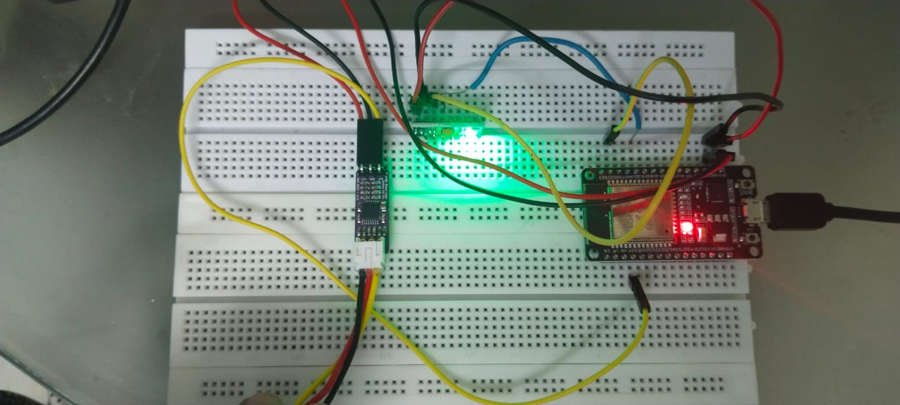
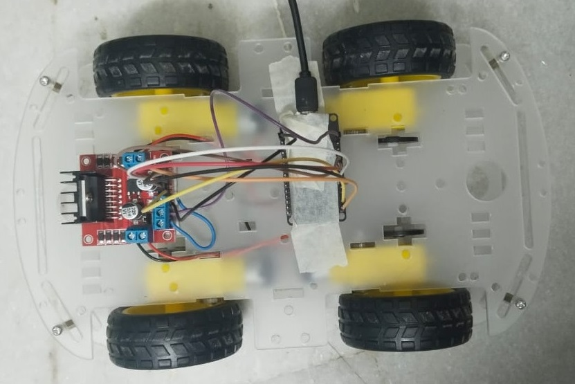

# 🧠 Brain-Controlled Mobility System (EEG + ESP32)

## 🎯 Objective
To design a real-time embedded system that enables mobility control using brain signals for physically disabled individuals.

---

## 📌 Problem Statement
Physically disabled individuals often face challenges in independent mobility. Traditional wheelchairs require manual effort or external assistance.

---

## 💡 Solution
This project presents a brain-controlled mobility system that uses EEG (Electroencephalogram) signals to control movement, enabling hands-free and intelligent navigation.

---

## ⚙️ Hardware Components
- ESP32 (Microcontroller)
- BioAmp EXG Pill (EEG signal acquisition)
- MPU6050 (Gyroscope for direction control)
- Motor Driver (L298N / similar)
- DC Motors
- Power Supply

---

## 🧠 Working Principle
- EEG signals are acquired using BioAmp EXG sensor  
- Signals are processed using ESP32  
- Blink detection is used for STOP command  
- Alpha/Beta brain waves are used for FORWARD movement  
- MPU6050 gyroscope controls LEFT/RIGHT direction  
- Commands are sent to motor driver to control mobility system  

---

## 🔄 System Flow
1. EEG Signal Acquisition  
2. Signal Processing (Filtering + Feature Extraction)  
3. Command Detection (Blink / Brain Waves)  
4. Direction Control using Gyroscope  
5. Motor Control using ESP32  

---

## 🚨 Emergency Control (Bluetooth Override)
To ensure safety and reliability, a Bluetooth-based manual control system is implemented.

- Allows external control via mobile application  
- Can override brain signal commands instantly  
- Useful in case of signal noise or incorrect detection  
- Ensures user safety in critical situations  

---

## 📊 Features
- Hands-free control using brain signals  
- Real-time signal processing  
- Multi-input control (EEG + Gyroscope)  
- Emergency Bluetooth manual override for safety  

---

## 📸 Output

### EEG Headset (Signal Acquisition)

### Mobility System / Robot

---

## 🚀 Future Scope
- AI-based EEG signal classification  
- Mobile app integration  
- Improved accuracy using machine learning  
- Integration with healthcare monitoring systems  

---

## 🛠️ Technologies Used
- Embedded C / Arduino  
- ESP32  
- Signal Processing  
- IoT Communication  

---

## 👩‍💻 Author
Zuha Fatima  
GitHub: https://github.com/ZoohaFatima
